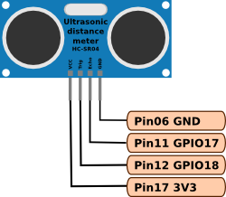

# PelletsStore
Measures wooden pellets level (used for heating) in a pellets store. 

## Description
This program is intended to run on a RaspberryPi as a cron script at regular intervals and is configuration through a file located at `/etc/pellets-store.conf`. 

An ultrasonic distance meter (HC-SR04), measures the level in the storage. In the config file, the hardware pins (Echo and Trigger) is configured and full and empty levels are set too. The pellets level is represented in percent.

`pellets-store` displays the result on `stdout`

`pellets-mysql` sends the data to a local or remote mysql-database, configured in the config file

`pellets-udp` sends the data to a server as a UDP-packet, for further processing.

## Hardware
My setup is a Raspberry Pi model A, with a HC-SR04 connected to pins 11 & 12 (GPIO17 & 18) and a WIFI-dongle (Realtek RTL8188CUS) providing a network connection. The data is stored on a remote MySQL server, to preserve the SD-card.



## Software
Requirements for the software is the WiringPi library and (optionally) libmysqlclient-dev.

Update your system:
```
	$ sudo apt-get update
	$ sudo apt-get upgrade
```
Installation of git and wiringPi:
```
	$ sudo apt-get install git-core
	$ git clone git://git.drogon.net/wiringPi
	$ cd wiringPi
	$ ./build
```
Installation of libmysqlclient-dev:
```
	$ sudo apt-get install libmysqlclient-dev
```
Installing the program:
```
	$ git clone https://github.com/hassebjork/PelletsStore/
	$ cd PelletsStore
	$ make
	$ sudo cp pellets-store.conf /etc/
```
To run the program every 10 minutes, add the following to crontab (using `crontab -e`):
```
  */10 * * * * sudo /path/to/program/pellets-mysql
```
